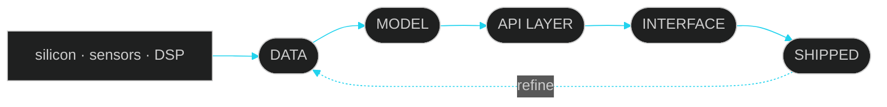

 

 

## ◆ &nbsp;`whoami`

> I don't stop at the notebook. A model that never reaches a user isn't a product — so I take it the whole way:
> **data → training → API → the interface someone actually touches.**
> And because I'm a *computer* engineer, that instinct runs all the way down to the silicon: microcontrollers, logic ICs, radar DSP, custom instruction sets.

## ◆ &nbsp;The Build Pipeline

## ◆ &nbsp;Arsenal

**Languages**

 

**AI / ML**

 

**Web & Mobile**

**Hardware & Signals**

**Tools**

## ◆ &nbsp;Flagship Builds

<table>
<tr>
<td width="50%" valign="top">

### 🛰️ NOVA-16 ISA Emulator

A browser-based emulator for a **custom 16-bit RISC architecture** — pipeline visualizer, cache simulator, hazard detection, and an **AI assembly-code generator**.

`Python` `Flask` `JavaScript` `Gemini API`

[**▶ Live demo**](https://nova-16-enhanced-isa-emulator.vercel.app)

</td>
<td width="50%" valign="top">

### 💼 JobConnect

Serverless full-stack recruitment platform connecting job seekers and employers through **real-time data** and automated comms workflows.

`React` `Firebase` `EmailJS` `Vercel`

[**▶ Live demo**](https://job-connect-delta-woad.vercel.app)

</td>
</tr>
<tr>
<td width="50%" valign="top">

### 🔭 Exoplanet Transit Detection

GUI-driven **Box Least Squares** pipeline that pulls planets out of raw light-curve noise, with interactive 3D orbital modelling.

`MATLAB` `Signal Processing`

[**▶ Code**](https://github.com/HassanKhalid8/Exoplanet-Transit-Detection-System)

</td>
<td width="50%" valign="top">

### 📡 Adaptive Radar DSP

LFM pulse compression, MTI clutter suppression, 2D range-Doppler FFT and **adaptive CFAR** thresholding across simulated X-band scenarios.

`MATLAB` `DSP`

[**▶ Code**](https://github.com/HassanKhalid8/adaptive-radar-signal-processing)

</td>
</tr>
</table>

<b>🔬 &nbsp;Engineering Lab — click to open the rest</b>

 

| Build | What it is | Stack |
|---|---|---|
| **[Smart IoT Kitchen](https://github.com/HassanKhalid8)** | A kitchen that watches itself — gas, flame and temperature sensors streaming to a live dashboard with remote alerts and appliance control | ESP32 · Blynk · Arduino |
| **IC-Based Smart Door Lock** | Sequential code-lock validated purely in hardware: five 4017 decade counters feeding a multi-input AND gate. No microcontroller, no firmware. | Digital Logic · Logic ICs |
| **Metal Detector** | Inductive proximity detector — TDA0161 IC plus a hand-wound AWG search coil, transistor-amplified buzzer output | Analog Electronics |
| **[PCA from Scratch](https://github.com/HassanKhalid8/Prncipal-Component-Analysis-CMT)** | Matrix-decomposition engine denoising a 167-country socioeconomic dataset, benchmarked against scikit-learn on four MSE metrics | Python · Numerical Analysis |
| **[Instant Messaging](https://github.com/HassanKhalid8/instant-messaging)** | Multi-threaded TCP sockets, custom binary framing and synchronized queue state for concurrent broadcast + unicast routing | Python · Networks |
| **[Online Store Management](https://github.com/HassanKhalid8/Online-Store-Management-System)** | Hand-built data structures — a BST for inventory indexing, a queue for sequential order processing | C++ · Data Structures |
| **[Virtual Pet Adoption](https://github.com/HassanKhalid8/Virtual-Pet-Adoption-System)** | Multi-tier pet management with dynamic state tracking and mini-game economies | C++ · OOP |

## ◆ &nbsp;Telemetry

  

<picture>
  <source media="(prefers-color-scheme: dark)" srcset="https://raw.githubusercontent.com/HassanKhalid8/HassanKhalid8/output/snake-dark.svg"/>
  <source media="(prefers-color-scheme: light)" srcset="https://raw.githubusercontent.com/HassanKhalid8/HassanKhalid8/output/snake.svg"/>
  
</picture>

## ◆ &nbsp;Certified

  

  

### Let's build something

<i>Usually replies within 24 hours. Faster if there's coffee.</i>

